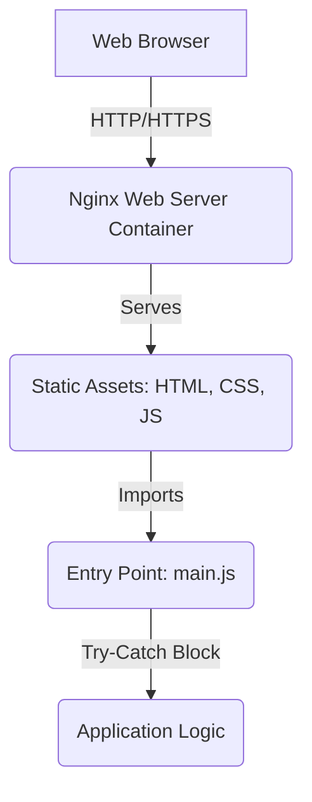

# Portfolio

This repository is built with strict enterprise engineering standards, focusing on resilient architecture, graceful error handling, and robust continuous integration.

## 🏗️ System Architecture



## 🚀 Setup Instructions

1. Ensure Docker and Docker Compose are installed.
2. Run the following command to start the application:

```bash
docker-compose up --build -d
```

3. Access the site at `http://localhost:8080`

## 🛠️ Dependency Rationale

- **Nginx Alpine**: Selected for its incredibly small footprint, security, and proven performance serving static assets.
- **Node.js (for testing)**: Used as a lightweight harness for our unit tests without requiring a heavy frontend testing framework.
- **Docker & Docker Compose**: Ensures environment parity across development, testing, and production.

## 📂 Structure

- `/src/` - Application source code (HTML, CSS, JS).
- `/tests/` - Unit tests ensuring business logic integrity.
- `.github/workflows/` - Continuous integration pipelines.